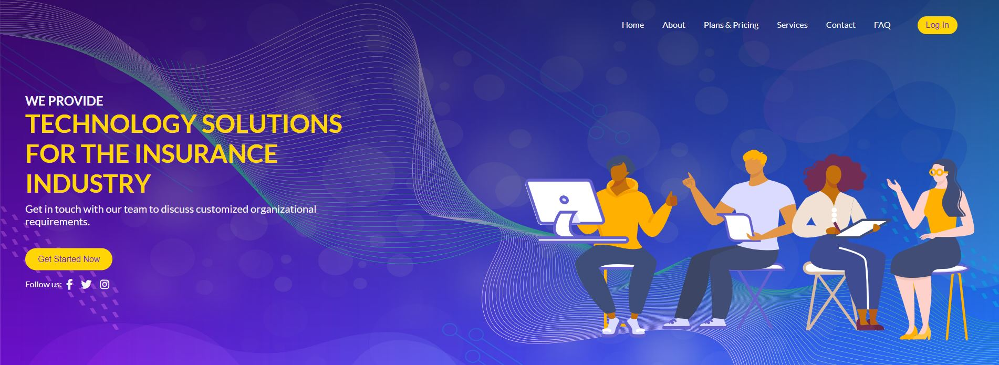
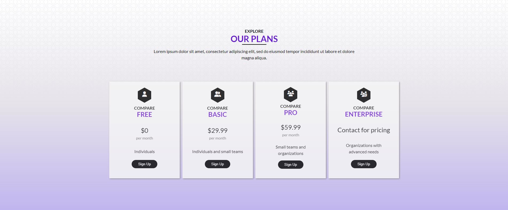
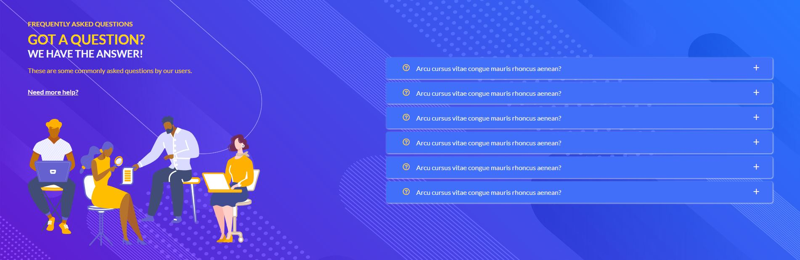
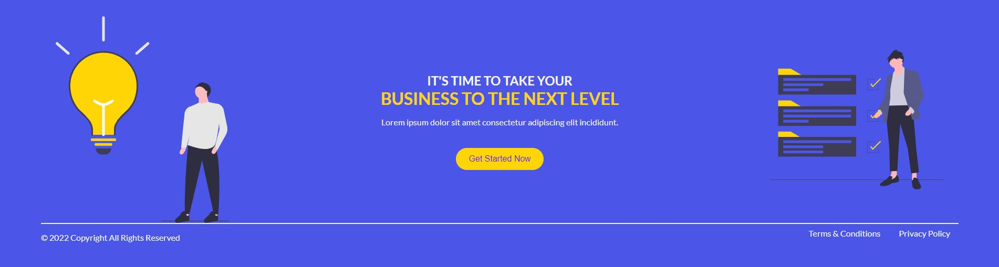

# Insurance Tech Tools

Insurance Tech Tools is a project for which I designed a homepage for a fictitious software company that offers technical services for insurance companies.

## Table of Contents

- [Technologies](#technologies)
- [Screenshots](#screenshots)
- [Status](#status)

## Technologies

This project was created with:

- JavaScript ES6
- HTML5
- CSS3 (SCSS)

## Screenshots

## Status

This project has been completed.